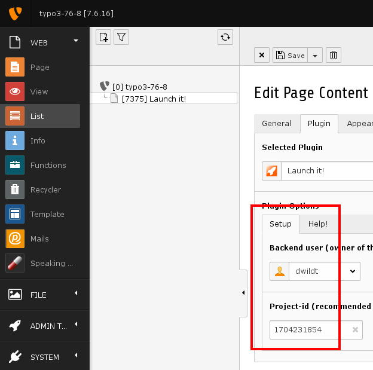

.. ==================================================
.. FOR YOUR INFORMATION
.. --------------------------------------------------
.. -*- coding: utf-8 -*- with BOM.

.. include:: ../../../Includes.txt

.. _introduction-screenshots-backend:

Backend
=======

Plugin
------

	The Launch it! plugin

You have nothing to do than

* select a proper backend-user and

* enter any project-id