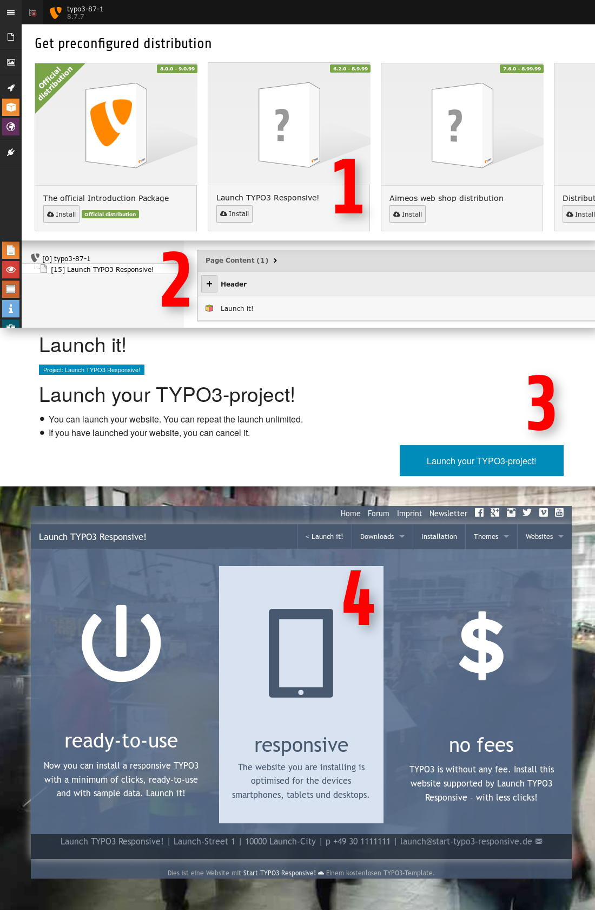

.. ==================================================
.. FOR YOUR INFORMATION
.. --------------------------------------------------
.. -*- coding: utf-8 -*- with BOM.

.. include:: ../../../Includes.txt

.. _introduction-screenshots-launchit:

Launch it!
==========

You can launch a ready-to-use website by Launch TYPO3 Responsive! (launchstart)

	Workflow: Launch TYPO3 Responsive!

Only some clicks and you have a ready-to-use website based on Start TYPO3 Responsive!

#. Install Launch TYPO3 Responsive! (launchstart)

#. The installer page will created automatically

#. Please click the button [Launch your TYPO3-project] in the frontend form

#. Enjoy your responsive website

Live
----

You can test the launch at http://start-typo3-responsive.de?18991