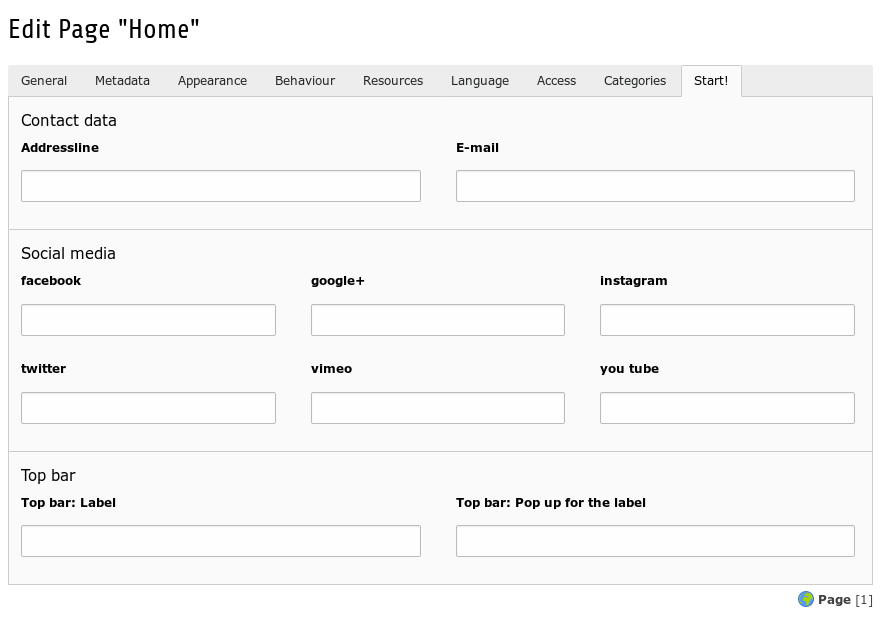

.. ==================================================
.. FOR YOUR INFORMATION
.. --------------------------------------------------
.. -*- coding: utf-8 -*- with BOM.

.. include:: ../../../Includes.txt

.. _editors_setup_essentials:

Essentials
==========

	Page properties Start!

You can control essential informations like the address data or hyperlinks to social networks on the root page for the whole website.

You can overwrite this data on subpages - i.e. for a sub-division.
