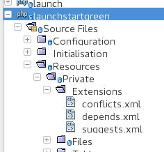

.. ==================================================
.. FOR YOUR INFORMATION
.. --------------------------------------------------
.. -*- coding: utf-8 -*- with BOM.

.. include:: ../../../Includes.txt

.. _integrators-create-dependencies:

Dependencies
============

Dependencies are defined in the ext_emconf.php-file of every extension.

You can define dependencies in your Launch-project additionally.

This isn't obligate but user-friendly.

XML
---

Dependencies are defined in XML-files.

You can define the extension with

* title and

* prompt

Both will rendered by the TypoScript-parser. This enables localisation for example.

See a sample code below.

Sample
------

File Structure
^^^^^^^^^^^^^^

	Dependency-files of Launch TYPO3 GRÜNE (launchstartgreen)

Above are shown the dependency-files of Launch TYPO3 GRÜNE (launchstartgreen).

See it at my git: https://gitlab.die-netzmacher.de/typo3/launchstartgreen/tree/master/Resources/Private/Extensions

Code
^^^^

.. code:: php

	<root>
		<records>
			<browser>
				<title>
					<_typoScriptNodeValue>TEXT</_typoScriptNodeValue>
					<value>Browser - responsive TYPO3 without PHP</value>
					<lang>
						<de>Browser - responsive TYPO3 ohne PHP</de>
						<en>Browser - responsive TYPO3 without PHP</en>
					</lang>
				</title>
			</browser>    
			<org>
				<title>Organiser - responsive TYPO3 for lobby and organisers</title>
				<title>
					<_typoScriptNodeValue>TEXT</_typoScriptNodeValue>
					<value>Organiser - responsive TYPO3 for lobby and organisers</value>
					<lang>
						<de>Organiser - responsive TYPO3 für Lobby und Veranstalter</de>
						<en>Organiser - responsive TYPO3 for lobby and organisers</en>
					</lang>
				</title>
			</org>    
			<powermail>
				<title>Powermail</title>
			</powermail>    
			<radialsearch>
				<title>Radial Search (German: Umkreissuche)</title>
			</radialsearch>    
			<seo_dynamic_tag>
				<title>SEO Dynamic Tag</title>
			</seo_dynamic_tag>    
		</records>    
	</root>