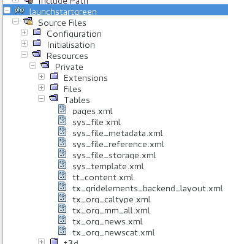
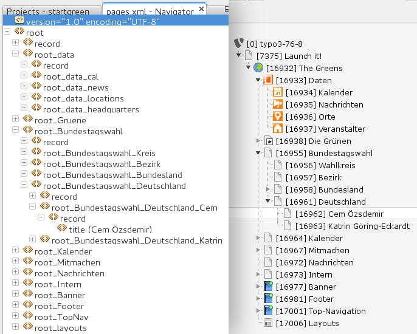

.. ==================================================
.. FOR YOUR INFORMATION
.. --------------------------------------------------
.. -*- coding: utf-8 -*- with BOM.

.. include:: ../../../Includes.txt

.. _integrators-create-database:

Database and Records
====================

XML
---

Records are defined in XML-files.

Each XML-file is named by the table, which should contained the record.

For example:

* Records for the table pages must stored in an XML-file called pages.xml

* Records for the table tt_content must stored in an XML-file called tt_content.xml

If records are stored with a page uid, they must managed by a site-structure (see pages.xml below).

Records can referenced, Launch it! manages the id of each record dynamically and reliable.

A tag within an XML-file must be unique.

Sample
------

File Structure
^^^^^^^^^^^^^^

	Table-files of Launch TYPO3 GRÜNE (launchstartgreen)

Above are shown the table-files of Launch TYPO3 GRÜNE (launchstartgreen).

See it at my git: https://gitlab.die-netzmacher.de/typo3/launchstartgreen/tree/master/Resources/Private/Tables

XML-Structure of pages.xml
^^^^^^^^^^^^^^^^^^^^^^^^^^

	Corresponding structure of the XML-file and the TYPO3 page-tree

Above is shown the XML-strcuture within the pages.xml-file of Launch TYPO3 GRÜNE (launchstartgreen).

See it at my git: https://gitlab.die-netzmacher.de/typo3/launchstartgreen/tree/master/Resources/Private/Tables/pages.xml

Code
^^^^

.. code:: php

	<root>
		<record>
			<title>
				<_typoScriptNodeValue>TEXT</_typoScriptNodeValue>
				<value>The Greens</value>
				<lang>
					<de>Die Grünen TYPO3</de>
					<en>The Greens</en>
				</lang>
			</title>
			<backend_layout>start__bronze_02</backend_layout>
			<backend_layout_next_level>start__bronze_02</backend_layout_next_level>
			<is_siteroot>1</is_siteroot>
			...
		</record>    
		...
		<root_Bundestagswahl>
			<record>
				<title>Bundestagswahl</title>
				<backend_layout>start__bronze_01</backend_layout>
				<backend_layout_next_level>start__bronze_01</backend_layout_next_level>
			</record>    
			...
			<root_Bundestagswahl_Deutschland>
				<record>
					<title>Deutschland</title>
				</record>    
				<root_Bundestagswahl_Deutschland_Cem>
					<record>
						<title>Cem Özdemir</title>
					</record>    
				</root_Bundestagswahl_Deutschland_Cem>    
				<root_Bundestagswahl_Deutschland_Katrin>
					<record>
						<title>Katrin Göring-Eckardt</title>
					</record>    
				</root_Bundestagswahl_Deutschland_Katrin>    
			</root_Bundestagswahl_Deutschland>    
		</root_Bundestagswahl>    
		...
	</root>
