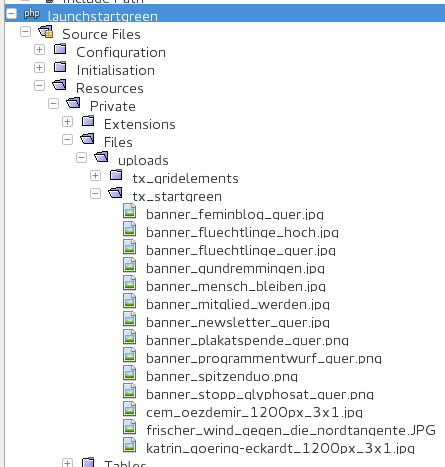

.. ==================================================
.. FOR YOUR INFORMATION
.. --------------------------------------------------
.. -*- coding: utf-8 -*- with BOM.

.. include:: ../../../Includes.txt

.. _integrators-create-files:

Files
=====

* Files can named without any restriction.

* The file name will get an unique id while the migration.
  This avoid any file-name conflict and enables the canceling of the launch.

* Files should be stored in the same directory tree like they should installed.

XML
---

Files must be registered in the tables of the FAL, the File Abstraction Layer.

See 

* sys_file.xml

* sys_file_metadata.xml

* sys_file_reference.xml and 

* sys_file_storage.xml

in the section above :ref:`Database <integrators-create-database>`

See it at my git: https://gitlab.die-netzmacher.de/typo3/launchstartgreen/tree/master/Resources/Private/Tables

Sample
------

Files
^^^^^

	Some files of Launch TYPO3 GRÜNE (launchstartgreen)

Above are shown the some files of Launch TYPO3 GRÜNE (launchstartgreen).

See it at my git: https://gitlab.die-netzmacher.de/typo3/launchstartgreen/tree/master/Resources/Private/Files

