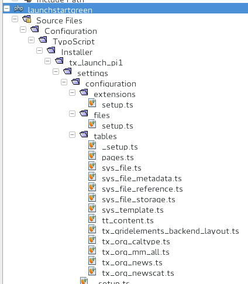

.. ==================================================
.. FOR YOUR INFORMATION
.. --------------------------------------------------
.. -*- coding: utf-8 -*- with BOM.

.. include:: ../../../Includes.txt

.. _integrators-create-setup:

Setup
=====

You are controlling the Launch by TypoScript.

This array is of relevance:

.. code:: php

	plugin.tx_launch_pi1.settings.configuration

Sample
------

TypoScript of Launch TYPO3-GRÜNE (startgreen)
^^^^^^^^^^^^^^^^^^^^^^^^^^^^^^^^^^^^^^^^^^^^^

.. figure:: typoscript.jpg
	:alt: TypoScript-object-browser

	TypoScript-object-browser

	TypoScript-files of Launch TYPO3-GRÜNE (startgreen)

If you like to follow the setup please refer to:

* Directory: https://gitlab.die-netzmacher.de/typo3/launchstartgreen/tree/master/Configuration/TypoScript/Installer/tx_launch_pi1/settings/configuration/

* Pages sample: https://gitlab.die-netzmacher.de/typo3/launchstartgreen/tree/master/Configuration/TypoScript/Installer/tx_launch_pi1/settings/configuration/tables/pages.ts

Code
^^^^

Example for the table pages.

.. code:: php

	plugin {
		tx_launch_pi1 {
			settings {
				configuration {
					tables {
						pages {
							defaults {
								doktype			= 1
								lastUpdated = TEXT
								lastUpdated {
									value     = now
									strtotime	= 1
								}
								perms_group = 1
								perms_user	= 31
								tstamp      = TEXT
								tstamp {
									value     = now
									strtotime	= 1
								}
							}
								// Path to the XML-configuration-file
							xml = typo3conf/ext/launchstartgreen/Resources/Private/Tables/pages.xml
						}
					}
				}
			}
		}
	}