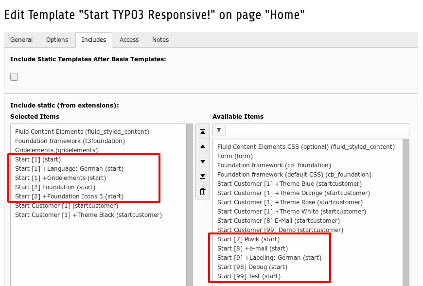
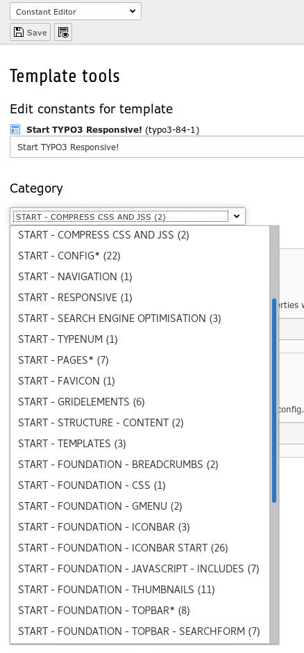

.. ==================================================
.. FOR YOUR INFORMATION
.. --------------------------------------------------
.. -*- coding: utf-8 -*- with BOM.

.. include:: ../../../Includes.txt

.. _introduction-screenshots-backend:

Backend
=======

.. figure:: 01_start_pageproperties.jpg
	:width: 600px
	:alt: Start page properties

	Start page properties

Start extends the page with some properties.
You can control important informations like the address data or hyperlinks to social networks on your root page for the whole website.
You can overwrite this data on subpages - i.e. for a sub-division.

	Start TypoScript templates

Start provides some TypoScript templates of course.

	Start user-interface (here: categories)

Start enables you to control more than 100 properties per user-interface - the Constant-Editor.
Usually you need to configure only the categories and fields with an asterisk (*). 
This are less than five :)

