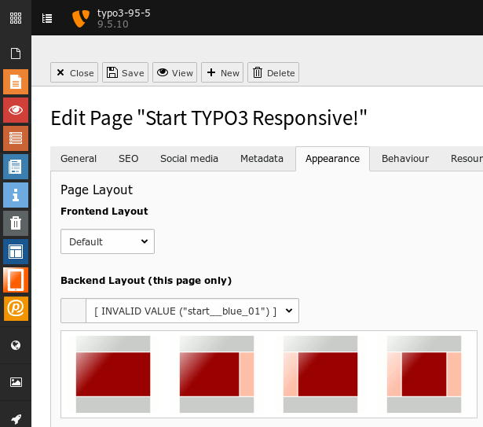
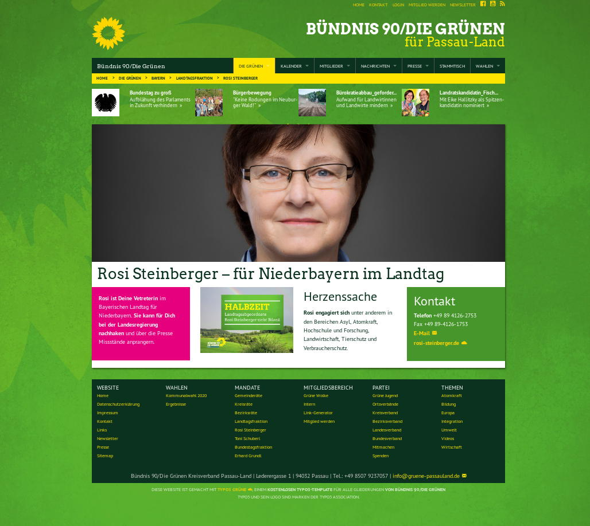

.. ==================================================
.. FOR YOUR INFORMATION
.. --------------------------------------------------
.. -*- coding: utf-8 -*- with BOM.

.. include:: ../../../../../Includes.txt

.. _users_bestpractice_layouts_basic_bronze:

Bronze
======

	The Start Bronze backend-layouts

	Example with a Start Bronze backend-layout

Profile
-------

Bronze templates are simple templates with a fixed width.

Areas
-----

Grey
''''

Header and footer. Inheritance on subpages when the header or footer on subpages is empty.

Red
'''

Content area. No inheritance on subpages.

Light red
'''''''''

Margin areas. Inheritance on subpages when the same area on subpages is empty.

Setup
-----

Page Properties
'''''''''''''''

You select a backend-layout at

* Module > Web: page

* Edit page properties

* Tab [Appaerance]

Extensionmanager
''''''''''''''''
If bronze layouts are visible and selectable in the backend, is crontrolled by
the administrator and the extension manager. See

* :ref:`Extensionmanager > Backend layout <administrators_setup_extensionmanager_backendlayout>`

Constant Editor
'''''''''''''''

The administrator can add and change CSS classes of rows by the Constant Editor. See

* :ref:`Administrators > Best practice > Layouts <administrators_bestpractice_layouts>`