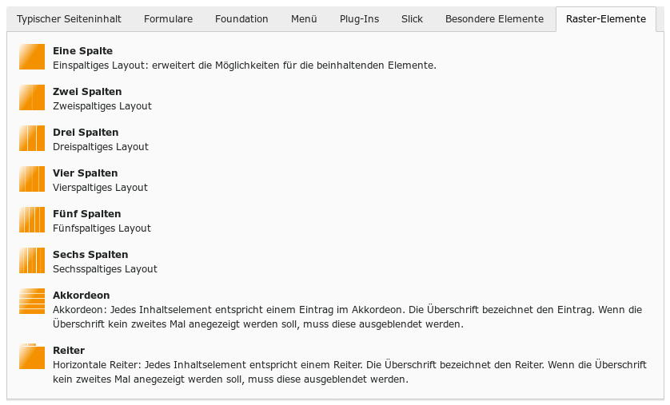
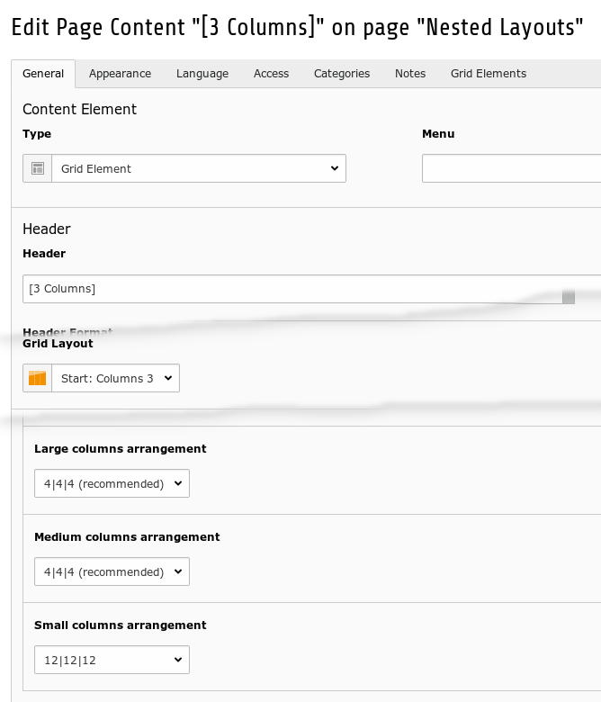
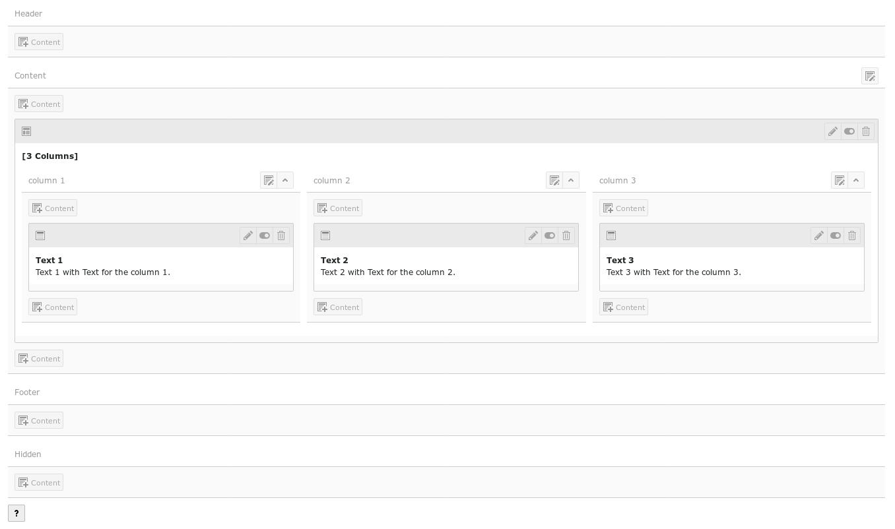
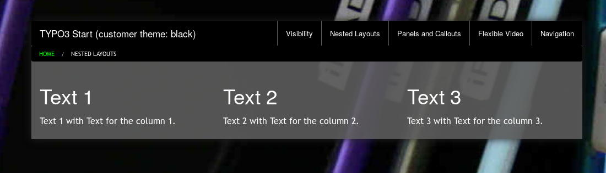
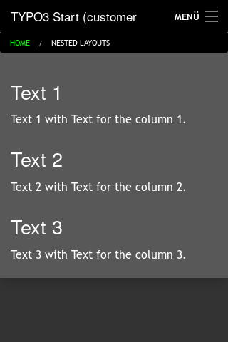

.. ==================================================
.. FOR YOUR INFORMATION
.. --------------------------------------------------
.. -*- coding: utf-8 -*- with BOM.

.. include:: ../../../../../Includes.txt

.. _users_bestpractice_layouts_element_general:

General
=======

You can assign content elements to grids. This is a powerful tool for individual designs.

Available grids are

* columns (1 to 6)

* accordion

* tab

Workflow
--------

	Gridelements in the content wizard

You can nest gridelements.

	Properties of a gridelement

You can control the responsive behaviour with the properties columns arrangement.

	3 columns gridelement with one text element per column

You can create every content element in the grid. A gridelement too.

Frontend
--------

	Result on a desktop

	Result on a smartphone

