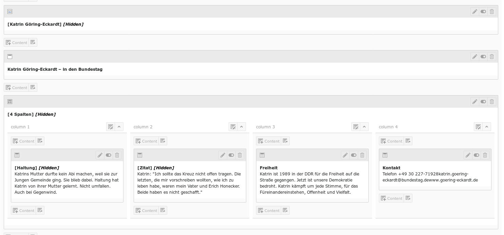
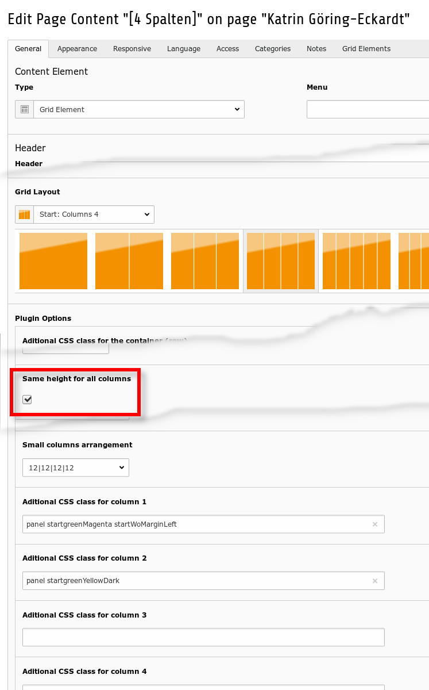
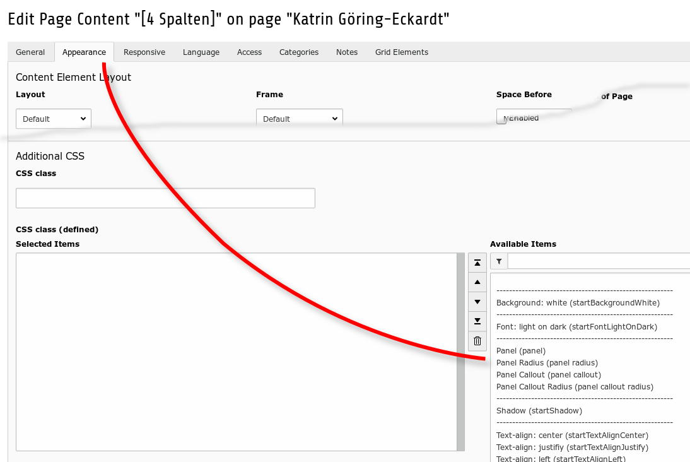

.. ==================================================
.. FOR YOUR INFORMATION
.. --------------------------------------------------
.. -*- coding: utf-8 -*- with BOM.

.. include:: ../../../../../Includes.txt

.. _users_bestpractice_layouts_element_sameheight:

Same Height for all columns
===========================

You can set the height of all columns to the same value. Currently, this feature
is only available if you use the responsive Framework Foundation.

Frontend
--------

	Same height for all columns (frontend)

All four columns have the same height in the illustration above.

Backend
-------

	Gridelement with four columns in the backend

The corresponding layout in the backend.

	Option: Same height for all columns

If you like same height for all columns, please activate the checkbox.

If you want to add a CSS class to a specific column, you are welcome.
How to find defined CSS classes is shown in the following figure.

	Defined CSS classes

Here you will find defined CSS classes:

* Tab [Appearance] > field: CSS class (defined)