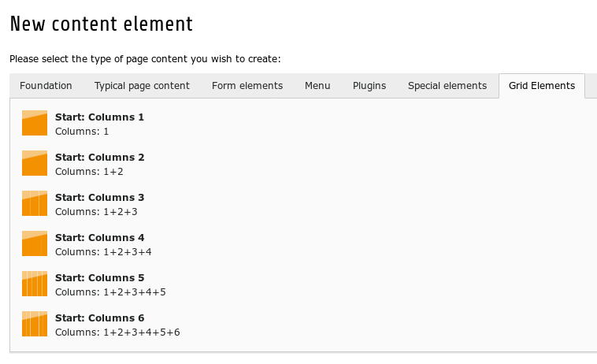
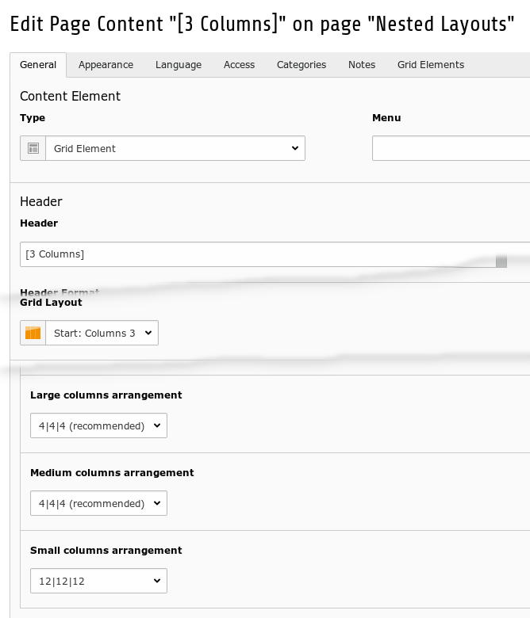
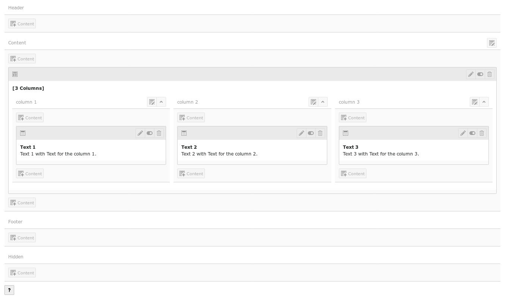
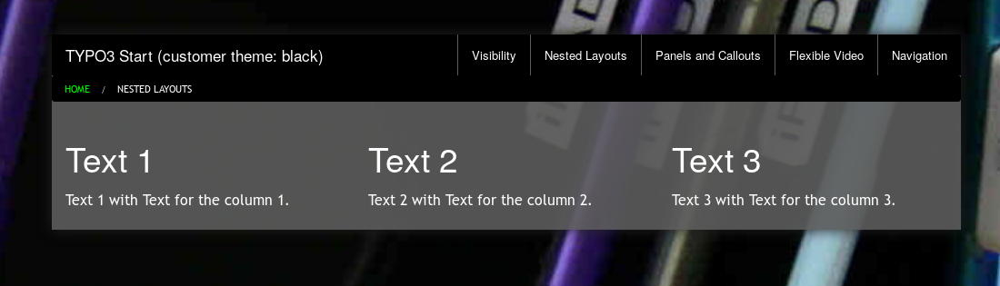
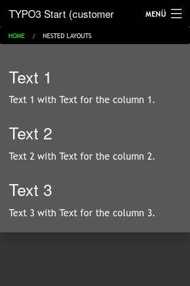

.. ==================================================
.. FOR YOUR INFORMATION
.. --------------------------------------------------
.. -*- coding: utf-8 -*- with BOM.

.. include:: ../../../../Includes.txt

.. _users_bestpractice_layouts_nested:

Nested Layouts
==============

You can nest layouts. This is a powerful tool for individual designs.

Workflow
--------

	Gridelements in the content wizard

There are six gridelements: from one to six columns.

You can nest gridelements.

	Properties of a gridelement

You can control the responsive behaviour with the properties columns arrangement.

	3 columns gridelement with one text element per column

You can create every content element in the grid. A gridelement too.

Frontend
--------

	Result on a desktop

	Result on a smartphone

