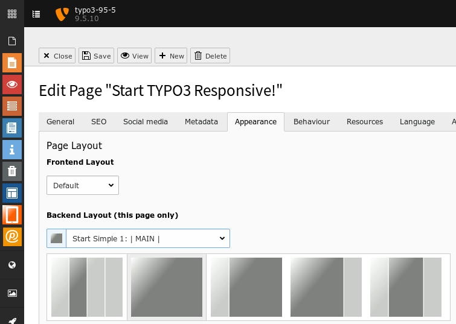

.. ==================================================
.. FOR YOUR INFORMATION
.. --------------------------------------------------
.. -*- coding: utf-8 -*- with BOM.

.. include:: ../../../../../Includes.txt

.. _users_bestpractice_layouts_page_default:

Default
=======

	The Start Default backend-layouts

Profile
-------

Standard templates are near by the original TYPO3 templates from earlier TYPO3 versions.
They are for backward compatibility only.

Areas
-----

Grey
''''

Content area. No inheritance on subpages.

Light grey
''''''''''

Margin areas. Inheritance on subpages when the same area on subpages is empty.

Setup
-----

Page Properties
'''''''''''''''

You select a backend-layout at

* Module > Web: page

* Edit page properties

* Tab [Appaerance]

Extensionmanager
''''''''''''''''
If bronze layouts are visible and selectable in the backend, is crontrolled by
the administrator and the extension manager. See

* :ref:`Extensionmanager > Backend layout <administrators_setup_extensionmanager_backendlayout>`