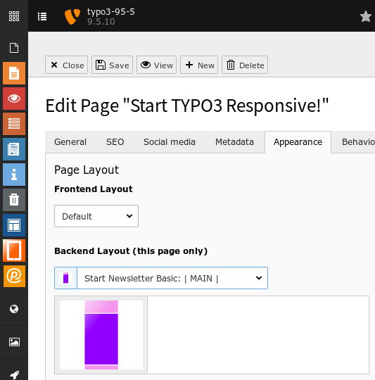

.. ==================================================
.. FOR YOUR INFORMATION
.. --------------------------------------------------
.. -*- coding: utf-8 -*- with BOM.

.. include:: ../../../../../Includes.txt

.. _users_bestpractice_layouts_page_newsletter:

Newsletter
==========

	The Start Newsletter backend-layouts

Profile
-------

The newsletter template is optimised for a simple newsletter.

Areas
-----

Pink
''''

Header and footer. Fixed width.

Purple
''''''

Content. Fixed width.

Setup
-----

Page Properties
'''''''''''''''

You select a backend-layout at

* Module > Web: page

* Edit page properties

* Tab [Appaerance]

Extensionmanager
''''''''''''''''
If bronze layouts are visible and selectable in the backend, is crontrolled by
the administrator and the extension manager. See

* :ref:`Extensionmanager > Backend layout <administrators_setup_extensionmanager_backendlayout>`