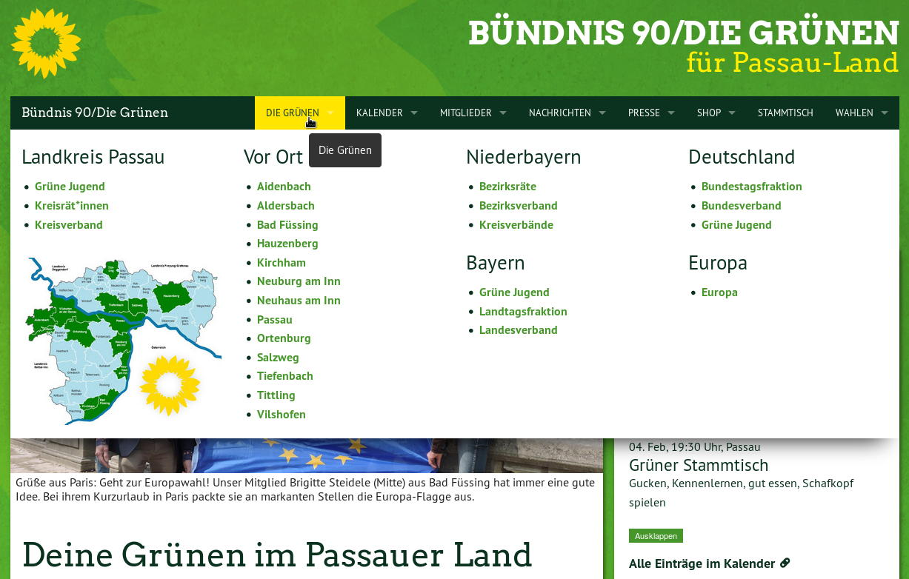
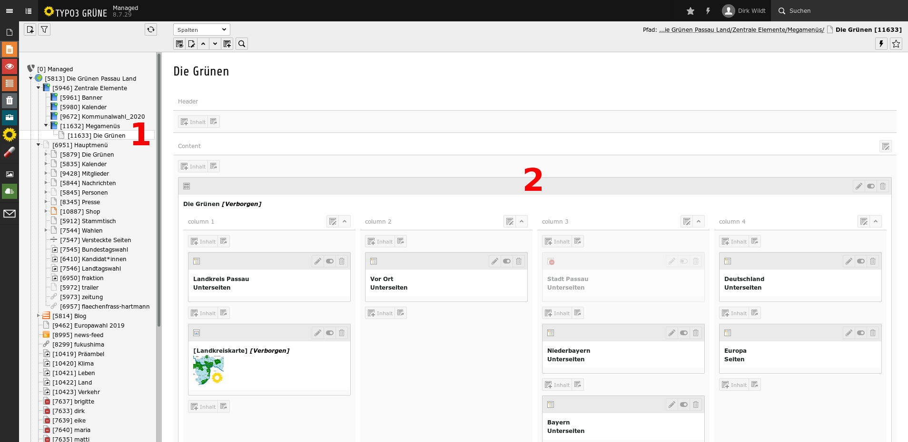
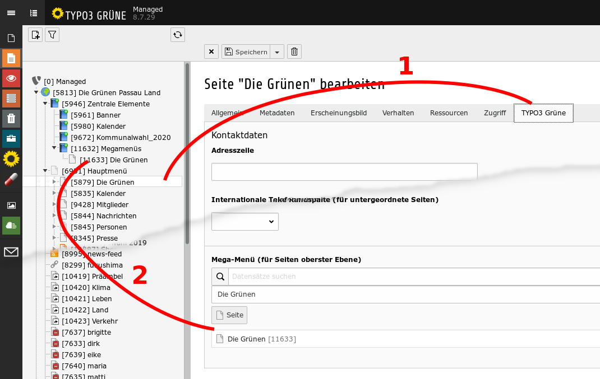

.. ==================================================
.. FOR YOUR INFORMATION
.. --------------------------------------------------
.. -*- coding: utf-8 -*- with BOM.

.. include:: ../../../../Includes.txt

.. _users_bestpractice_navigation_megamenu:

Mega-Menu
=========

  Mega menu TYPO3 START. Here: example Kreisverband Passau-Land

Sense and purpose
-----------------

You can use a mega menu to replace submenus in your main navigation.

You can customize the mega menu - for example in columns and with pictures.

A mega menu can be useful if many levels are displayed in a submenu
and you want to save your visitors in the nested entries to find your way.

Shape
-----

  Mega menu TYPO3 START. Here: example des Kreisverbandes Passau-Land

#. You set up a page outside of the navigation, for example with the name
   "Mega-Menu The Greens"

#. You design this page the way you want it. In the picture above
   for example, four columns are created, each is populated with the content
   element "Menu sub-pages".

Insert
------

  Mega menu TYPO3 START. Here: example des Kreisverbandes Passau-Land

#. Edit the properties of the page in the main menu that you want
   to assign the mega menu. In the picture above: Main menu > The Greens

#. Select the tab [TYPO3 START] and below the field "Mega menu". Choose
   here the page you set up with the mega menu.