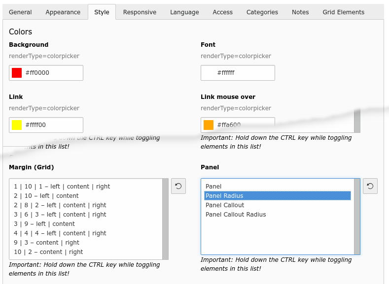
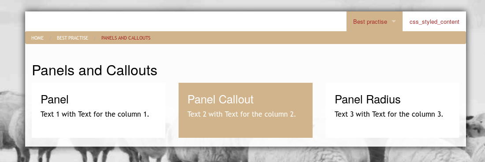
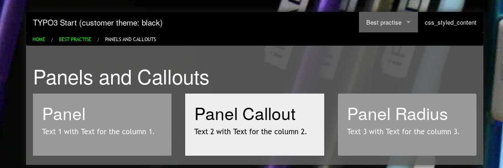

.. ==================================================
.. FOR YOUR INFORMATION
.. --------------------------------------------------
.. -*- coding: utf-8 -*- with BOM.

.. include:: ../../../Includes.txt

.. _users_bestpractice_panelsandcallouts:

Panels and Callouts
====================

You can control panels and callouts with so called defined CSS classes.

You have only to pick up the panel class in the select box.

	Content element with the tab [Style]

	Panels (theme white)

	Panels (theme black)

You can style more properties. Please refer to :ref:`Styling <users_bestpractice_styling>`
