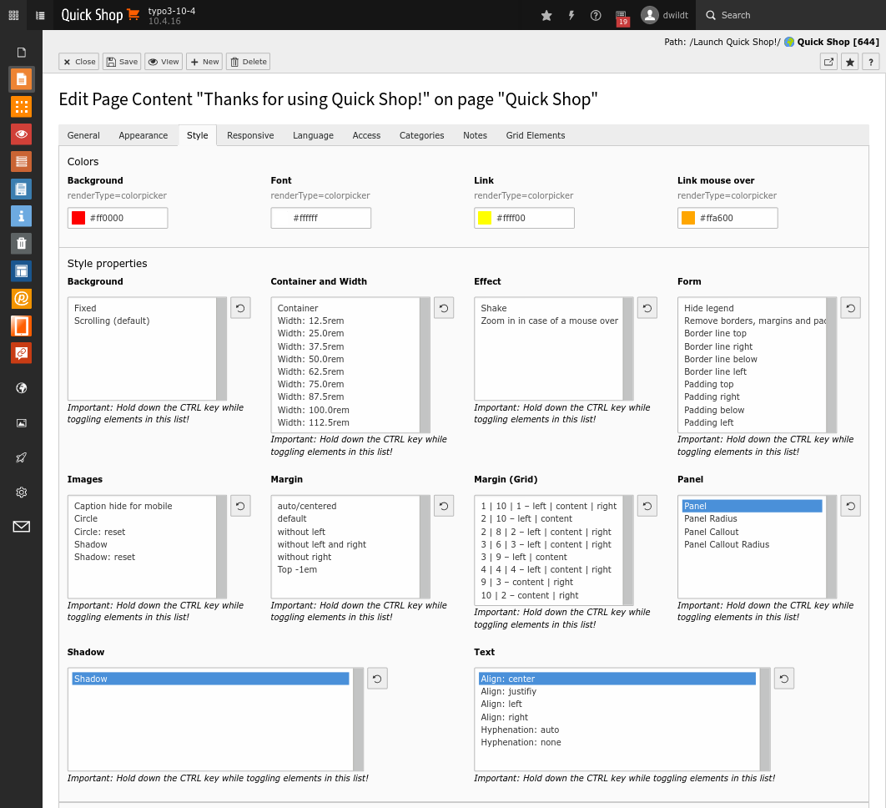

.. ==================================================
.. FOR YOUR INFORMATION
.. --------------------------------------------------
.. -*- coding: utf-8 -*- with BOM.

.. include:: ../../../Includes.txt

.. _users_bestpractice_styling:

	Content element with the tab [Style] 

Styling
=======

Start extends content elements with the tab [Style]. See illustration above.

You can controll design properties like:

* Background color

* Colors 

* Effects

* Forms

* Hyphenation

* Images

  * as circles

  * with shadow

* Margins

* Shadow of content elements

* Text alignment

If you are using an extension of the start family like startgreen, you will get further classes.

Sample
------

Please refer to :ref:`Panels and Callouts <users_bestpractice_panelsandcallouts>`