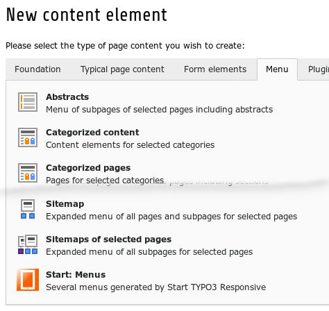
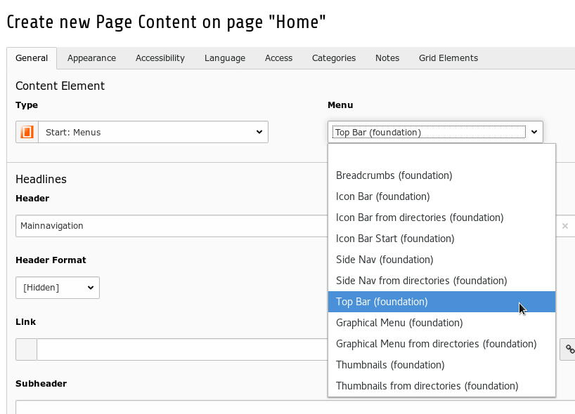
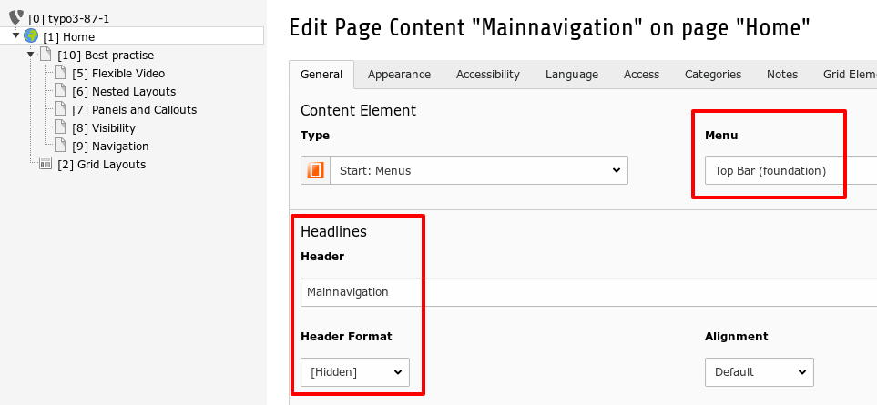
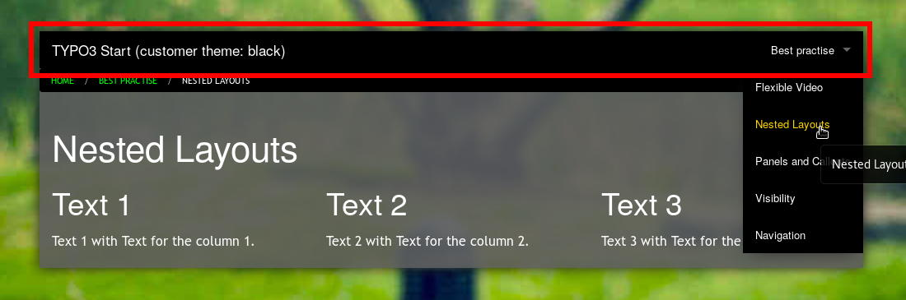

.. ==================================================
.. FOR YOUR INFORMATION
.. --------------------------------------------------
.. -*- coding: utf-8 -*- with BOM.

.. include:: ../../Includes.txt

.. _users_bestpractise_navigation:

Navigation
==========

Screenshots
-----------

	Content wizard with Start menus

	Content element with the type [Start: menus]

Content element with the type [Start: menus]. You can select one of 11 possible menus.

	Start menu: Top Bar (foundation)

In the illustration above is selected the top bar - the main navigation.

See the result in the frontend in the illustration below.

	Site with the menu Top Bar (foundation)

Menus
-----

Start provides 11 menus. Usually they are responsive.

Selected pages: If you enter a value, several menu will use the item (or the items) for the menu building.

If the label of a menu is extended with "from directory" a selected page will handled as a directory.

Constant Editor
^^^^^^^^^^^^^^^

Some properties are controlled by the Constant Editor. See categories:

- START - NAVIGATION

- START - FOUNDATION - ...

You need administrator access.