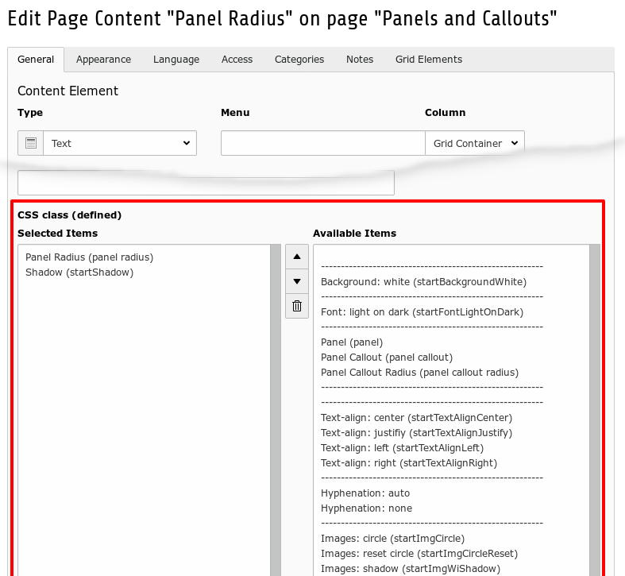

.. ==================================================
.. FOR YOUR INFORMATION
.. --------------------------------------------------
.. -*- coding: utf-8 -*- with BOM.

.. include:: ../../Includes.txt

.. _users_bestpractise_styling:

Styling
=======

Start works with several so called defined CSS classes.

You enable  these defined classes in the user interface of a content element. See illustration below.

You can controll design properties like:

- Background color

- Font color

- Hyphenation

- Images

  - as circles

  - with shadow

- Margins

- Shadow of content elements

- Text alignment

If you are using an extension of the start family like startgreen, you will get further classes.

	CSS Classes (defined)

Sample
------

Please refer to :ref:`Panels and Callouts <users_bestpractise_panelsandcallouts>`
