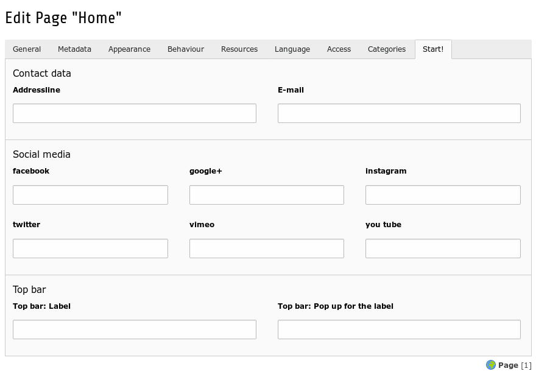
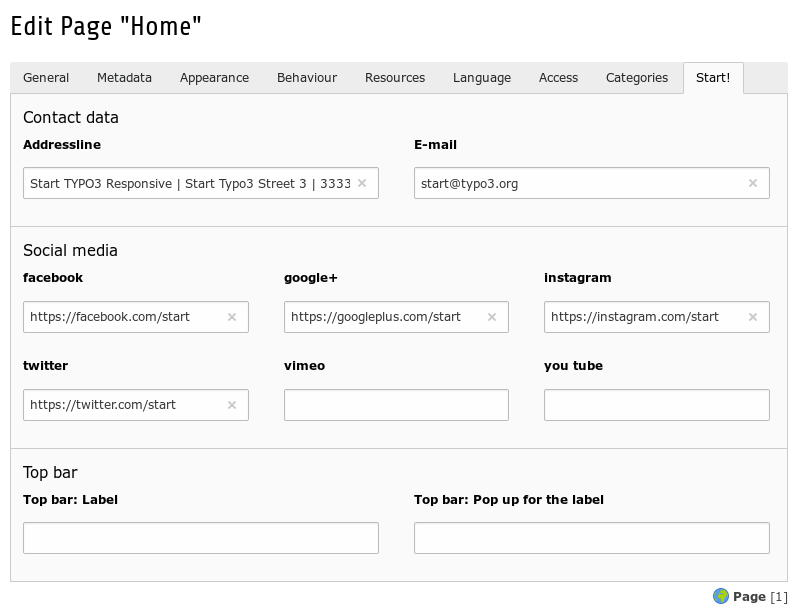
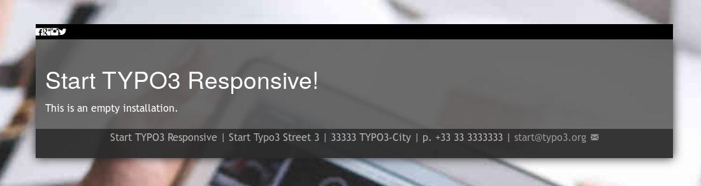

.. ==================================================
.. FOR YOUR INFORMATION
.. --------------------------------------------------
.. -*- coding: utf-8 -*- with BOM.

.. include:: ../../../Includes.txt

.. _users_setup_essentials:

Essentials
==========

	Page properties Start!

You can control essential informations like the address data or hyperlinks to social networks on the root page for the whole website.

You can overwrite this data on subpages - i.e. for a sub-division.

Contact Data
------------

Contact data will placed in the footer.

Social Media
------------

Hyperlinks to social media will get an icon on top of the site.

Top Bar
-------

You can label the main item in the top bar and the prompt of the pop up.

Sample
------

.. figure:: 01_start_desktop_wo_essentialdata.jpg
	:width: 600px
	:alt: Site without any contact data and hyperlinks to social media

	Site without any contact data and hyperlinks to social media

	Page properties Start! with sample data

	Site with contact data (footer) and hyperlinks to social media (on top)
